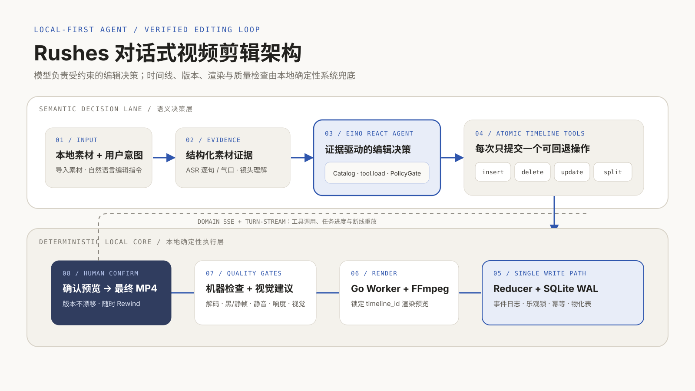

# Rushes

面向视频创作者的 **本地优先对话式剪辑 Agent**。

它解决的不是「用一句 prompt 生成一条视频」，而是更具体的编辑问题：怎样让一个知道成片意图、却不熟悉轨道、关键帧和编解码的人，通过自然语言完成可验证、可回退、可以真正交付的剪辑。


<br>
<sub>Rushes 对话式剪辑架构 · 语义决策层与本地确定性执行层</sub>

## 产品设计

传统专业剪辑软件要求用户先学会时间线、轨道和参数；黑盒式 AI 成片工具又经常把「理解意图」和「直接生成结果」绑在一起，难以解释改了什么，也很难安全返工。

Rushes 把自然语言变成剪辑控制层，但仍让帧级时间线成为成片的唯一事实源：

- 用户负责描述意图、判断效果，并确认破坏性动作和最终导出。
- Agent 负责检索素材证据，把开放的创作判断拆成受约束的原子编辑。
- Harness 负责素材索引、状态注入、权限、Stop Gate、预览和质量检查。
- 本地 Worker 负责 FFmpeg 媒体任务；Reducer 与 SQLite 负责版本、幂等和可靠落盘。

因此，Rushes 不是「聊天框贴在剪辑器旁边」，也不是把整条生产链交给一个黑盒模型。它是一套 **一个主编辑 Agent + 专业工具 + 后台 Worker** 的人机协作系统。

## 为什么是本地优先

视频素材体积大、隐私敏感，频繁上传云端也会拉长每次编辑的反馈时间。Rushes 把工作空间、素材对象、SQLite 数据库、时间线、预览渲染和最终导出都留在用户设备上；外部模型只接收当前任务所需的最小证据。

- 本地媒体通过 Range / HEAD 端点按需播放，不进入前端 bundle，也不会整段塞进 Agent 上下文。
- 镜头、ASR 逐句、气口和拍点先被结构化，再以稳定 ID 供模型检索和引用。
- 每次时间线修改都产生新版本，当前版本可以检查、追踪和 Rewind。
- 所有模型和后台任务结果都要回到本地状态机，Agent 的一句「完成了」不等于真正完成。

## 从一句话到成片的剪辑闭环

用户可以直接表达「删掉重复的这句话」「去掉太长的气口」「这里盖一段相关 B-roll」或「按鼓点重排这些镜头」。系统把这类意图放进同一条可审计主线。

### 1. 导入并理解本地素材

API 先登记素材和 ingest job。Worker 以 claim / lease / heartbeat 协议生成媒体 probe、缩略图和代理文件，再建立后续剪辑需要的结构化证据：

- 口播素材通过 SRT 或 ASR 建立逐句、逐词和气口索引。
- 普通视频按镜头建立语义描述与精确源帧范围。
- 音频分析产出 BPM 与拍点，供卡点剪辑使用。
- 重复分析按素材 hash、参数和 prompt 版本复用，不重复消耗模型调用。

完整转写和逐镜头细节不会常驻每轮 Context。Agent 只看到精简的素材目录，并在真正需要时通过 `speech.search`、`shot.search` 或 `shot.deep_search` 读取证据。

### 2. Agent 提交原子时间线编辑

Eino ReAct Agent 不接触文件路径、FFmpeg 命令或任意时间线 JSON。通用写入只保留四个动作：

- `timeline.insert`：插入一段素材、BGM 或 SFX。
- `timeline.delete`：删除指定时间线对象或区间。
- `timeline.update`：修改位置、源区间、增益等已有属性。
- `timeline.split`：在合法帧位置拆分片段。

每次调用只提交一个操作，并独立生成一个可回退的 `timeline_id`。素材 ID、镜头 ID、源帧范围和版本不匹配时会返回稳定错误；系统不会猜测模型本来想修改哪个新目标。

### 3. Stop Gate、预览与质量检查

原子修改成功只代表「这一步写入成功」，不代表整条时间线已经可以交付。Agent 准备结束编辑时，Harness 才对最新、精确的 `timeline_id` 运行一次完整 Stop Gate：

- 时间线仍有结构问题时，最多回灌 3 项可行动问题，让 Agent 有界修复。
- 检查通过且任务需要画面或声音验收时，才生成该版本的预览。
- Preview QA 并行检查解码、黑帧、静帧、静音和响度，并按需附加视觉 advisory。

最终导出不属于模型工具。用户在界面中确认效果、选择画幅并触发导出后，API 才把当前时间线和版本固定到持久任务，生成最终 MP4。

## Agent 能力如何被收紧

Rushes 当前的 Model Action Catalog 包含 13 个动作：

| 能力边界 | Model Action |
| --- | --- |
| 素材证据 | `shot.search` · `shot.deep_search` · `speech.search` |
| 计划、交互与记忆 | `plan.update` · `interaction.ask_user` · `interaction.confirm_action` · `decision.answer` · `memory.set` · `memory.remove` |
| 原子时间线编辑 | `timeline.insert` · `timeline.delete` · `timeline.update` · `timeline.split` |

Catalog 只向模型说明有哪些能力，不常驻全部参数 schema。Provider 初始只绑定 `tool.load`；模型必须按当前回合需要精确加载 action，系统再从当前 transcript 的成功回执计算已加载集合。Schema loading 只改变模型能看到的接口，不会绕过 Registry、Precondition、PolicyGate、edit lease、Executor 或 Reducer。

素材基础索引、ASR、拍点分析、完整时间线检查、预览和 Preview QA 属于 Harness Automatic Capabilities，不进入 Catalog，也不能由模型伪造执行结果。长期记忆删除等破坏性动作需要确认；普通时间线编辑保持可回退。

## 上下文与状态

Rushes 不把聊天记录当作项目事实。每轮执行前，`ContextBuilder` 都会从 SQLite 重建带稳定 section ID 的 `WorldState`，其中包含当前素材目录、时间线、任务和交付状态。

- 首轮保存完整 WorldState，后续只注入 RFC 7396 Merge Patch。
- UI 消息、工具折叠记录和模型窗口分开持久化，旧回复不能覆盖最新客观状态。
- 历史超过预算时，旧消息被结构化交接摘要替换；尚未执行的排队消息不会提前泄漏进本轮。
- 同一 draft 的 turn 由 `TurnQueue` 保序，不同 draft 可以并行。
- domain SSE 与 turn-stream 分别承载状态失效和 Agent 流式过程，断线后可以重放当前回合快照。

## 本地确定性内核

模型负责开放的创作判断，确定性系统负责执行、安全和证据链。

### Reducer：唯一业务写路径

所有业务状态只能通过 `reducer.Apply` 写入。`strict` 事件用 `state_version` 做乐观锁；`merge` 事件用稳定 merge key 去重。事件日志、物化表和工具 ResultRows 在同一个 `BEGIN IMMEDIATE` 事务提交，避免「事件成功、读模型缺失」的半状态。

### SQLite Worker：可恢复的后台任务

SQLite 运行在 WAL 模式。任务由条件 `UPDATE` 原子 claim，`worker_id + heartbeat_at` 构成租约；超时任务可以回收，失败按指数退避，`(kind, idempotency_key)` 保证重复入队安全。Job 终态只能由 Worker 经 Reducer 写回，API 和 Agent 只负责登记任务。

### FFmpeg：可取消、可观测的媒体执行

媒体命令从统一执行层启动。FFmpeg 运行在独立进程组，取消时先向整个进程组发送 SIGINT，让 MP4 有机会完成 moov 写入；进度读取 `-progress pipe:1` 的机器可解析字段，不依赖容易漂移的 stderr 文案。预览同时固化宽高、FPS、时长和对应时间线快照，避免后续拿新状态误判旧成片。

## 工程架构

- **React 19 + Vite 7**：围绕素材、对话、时间线、预览和导出组织的本地 Web 编辑器。
- **Go 1.26 + chi**：REST、OpenAPI、鉴权、domain SSE、turn-stream 和本地媒体服务。
- **CloudWeGo Eino**：ReAct Agent、流式模型调用和渐进工具 schema 绑定。
- **modernc SQLite**：事件日志、物化状态、任务、上下文 checkpoint 和媒体证据。
- **Go Worker + FFmpeg / FFprobe / aubio**：素材理解、代理文件、音频分析、预览、质检和导出。

```text
go/
  cmd/api/            API 进程入口
  cmd/worker/         Worker 进程入口
  internal/
    contracts/        事件注册、版本模式与 SSE 路由
    storage/          SQLite、迁移、读模型与对象路径
    reducer/          校验、乐观锁、幂等与同事务物化
    agent/            Eino ReAct、Context、TurnQueue 与 Stop Gate
    agentexec/         Agent 统一执行入口
    tools/             Catalog、PolicyGate、Precondition 与工具实现
    providers/         DashScope Qwen / Volcengine Ark 适配
    understanding/     镜头、ASR、拍点与证据索引
    timeline/          帧级时间线编译与校验
    media/             FFmpeg 执行、渲染与质量检查
    worker/            job claim、lease、heartbeat、retry
    api/               chi、OpenAPI、鉴权、SSE 与媒体端点
apps/web/              React / Vite 前端
e2e/                   直接指向 Go 后端的 Playwright 主线
```

更完整的运行时、不变量、Stop Gate 和上下文设计见 [`docs/architecture.md`](docs/architecture.md)。依赖方向由 `go/.golangci.yml` 的 depguard 固化，违反分层会在 CI 直接失败。

## 本地启动

### 前置依赖

- Go 1.26
- Node.js 24
- ffmpeg / ffprobe
- aubio
- uv（本地 STT 的 Python 3.12 與鎖定依賴）
- pnpm 10.13.1（仓库命令会通过 `npx` 使用固定版本）

macOS 可以直接安装并启动：

```bash
brew install go ffmpeg aubio node uv
make install-web
make dev
```

`make dev` 会构建并拉起 Go API、Go Worker 和 Vite。默认地址：

| 服务 | 地址 |
| --- | --- |
| Web | `http://127.0.0.1:8011` |
| API | `http://127.0.0.1:8010` |
| API metrics | `http://127.0.0.1:8010/debug/metrics` |
| Worker metrics | `http://127.0.0.1:8012/debug/metrics` |

首次启动会生成强随机的本地访问 token，以 `600` 权限写入已被 Git 忽略的根目录 `.env`，并输出一次带 `#t=` 的授权 URL。浏览器保存授权后即可使用普通 Web 地址。工作空间默认位于 `.rushes/`；端口和路径可通过 `RUSHES_API_PORT`、`RUSHES_WEB_PORT`、`RUSHES_WORKER_METRICS_PORT`、`RUSHES_WORKSPACE_PATH` 覆盖。

### 本機素材匯入

不設定 `RUSHES_FS_ROOTS` 時，API 會以目前用戶的 Home、Movies、Desktop 以及 macOS 的 `/Volumes` 作為可瀏覽根目錄，partner clone 後即可使用；如要收窄範圍，可在 `.env` 填寫絕對路徑，多個路徑以 `:`（macOS/Linux）或 `;`（Windows）分隔。已 export 的同名環境變數優先於 `.env`。

## 模型配置

根目录 `.env` 是本地开发和手工运行的统一配置源；已显式 `export` 的同名变量优先。

### Nous Research（預設）

預設聊天與視覺 Provider 是 Nous Research 官方 OpenAI-compatible endpoint，聊天與視覺共用同一組 API key 與 Base URL：

```dotenv
RUSHES_CHAT_PROVIDER=nous
RUSHES_NOUS_API_KEY=sk-nous-...
RUSHES_NOUS_BASE_URL=https://inference-api.nousresearch.com/v1
RUSHES_NOUS_CHAT_MODEL=deepseek/deepseek-v4.1-flash
RUSHES_NOUS_VISION_MODEL=deepseek/deepseek-v4.1-flash
```

預設模型同時支援 image 輸入與 tools，因此聊天、剪接決策及畫面分析可以共用同一模型。缺少 key 時，API 與 worker 會在啟動時明確失敗，不會靜默降級。這個開關不影響 ASR；語音辨識由獨立的 `RUSHES_ASR_PROVIDER` 決定。

### 本地語音辨識（預設）

Apple Silicon Mac 預設在本機以 MLX Whisper large-v3 建立口播索引，音訊不會因失敗而自動轉交雲端：

```dotenv
RUSHES_ASR_PROVIDER=local
RUSHES_LOCAL_STT_MODEL=mlx-community/whisper-large-v3-mlx
```

`make dev` 會按鎖定依賴建立獨立 Python 3.12 環境。本地 STT 服務啟動後會在背景下載及暖機模型；素材匯入、畫面分析與其他剪接功能可以照常使用。素材面板會顯示準備狀態，網絡下載錯誤最多自動重試兩次，整輪準備上限 30 分鐘；失敗後可在 UI 手動重試。模型快取由 Hugging Face 共用，後續啟動不會重複下載。

本地 STT 目前正式支援 Apple Silicon Mac。其他平台請明確設定 `RUSHES_ASR_PROVIDER=dashscope` 並提供 DashScope key。

### DashScope

切換到 DashScope：

```dotenv
RUSHES_DASHSCOPE_API_KEY=sk-...
RUSHES_QWEN_CHAT_MODEL=qwen3.7-max
RUSHES_QWEN_VISION_MODEL=qwen3.7-plus
RUSHES_DASHSCOPE_ASR_MODEL=fun-asr-flash-2026-06-15
```

没有模型密钥时，本地导入、SQLite、Worker、时间线、渲染和 UI 仍可运行；聊天会明确进入无模型降级路径。

### 火山方舟 Ark

聊天与视觉可以人工切换到 Ark：

```dotenv
RUSHES_CHAT_PROVIDER=ark
RUSHES_ARK_API_KEY=...
RUSHES_ARK_CHAT_MODEL=...
RUSHES_ARK_VISION_MODEL=...
```

亦可以用 `RUSHES_ARK_ACCESS_KEY` / `RUSHES_ARK_SECRET_KEY` 代替 API Key。選擇 `ark` 後必須提供聊天及視覺模型 ID，否則 API 與 Worker 會在啟動時明確失敗。這個開關不影響 ASR；語音辨識由獨立的 `RUSHES_ASR_PROVIDER` 決定。系統不會在兩個 Provider 之間靜默自動 failover。

## 开发与验证

```bash
make contracts   # OpenAPI 与 SSE golden 契约零漂移
make test        # Go 全量 -race
make coverage    # 手写 Go 核心覆盖率 >= 90%
make lint        # go vet + golangci-lint / depguard
make web         # TypeScript + Vitest + production build + bundle budget
make e2e         # Go E2E scaffold + Playwright 主线
make check       # 依次运行以上全部门禁
```

真实 Provider 测试带 `integration` build tag，默认跳过。只有已经配置真实密钥并明确要验证模型链路时，才使用 `RUSHES_REQUIRE_LIVE_MODELS=1` 强制运行。
